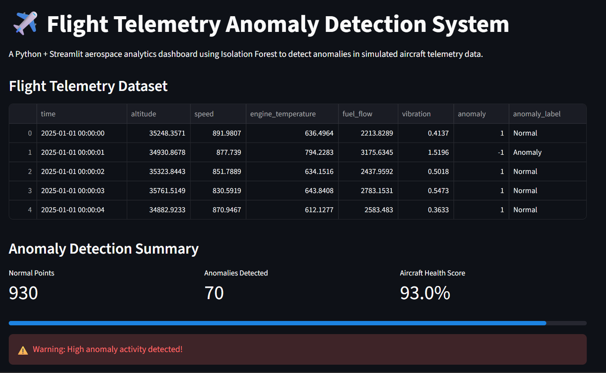
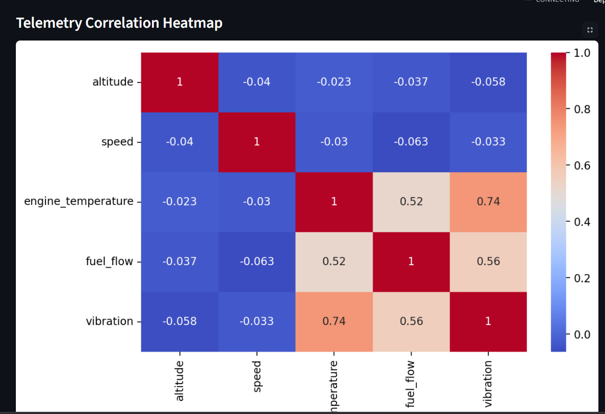
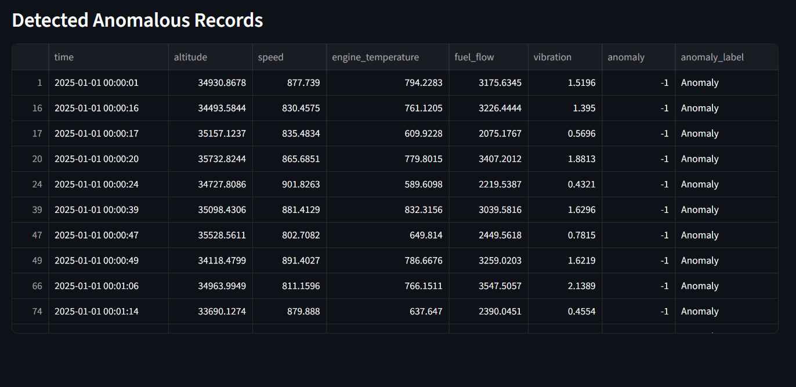

# ✈️ Flight Telemetry Anomaly Detection System

# 📸 Dashboard Preview

## Main Dashboard



## Correlation Heatmap



## Anomaly Detection



# Flight Telemetry Anomaly Detection System

A Python + Streamlit aerospace analytics project that detects anomalies in simulated aircraft telemetry data using Machine Learning.

---

#  Features

- Simulated aircraft telemetry dataset
- Isolation Forest anomaly detection
- Interactive Streamlit dashboard
- Aircraft health monitoring
- Real-time telemetry visualization
- Correlation heatmap analysis
- Detection of abnormal flight behavior

---

#  Telemetry Parameters

The system monitors:

- Altitude
- Speed
- Engine Temperature
- Fuel Flow
- Vibration

---

#  Machine Learning Model

This project uses:

## Isolation Forest

Isolation Forest is an unsupervised machine learning algorithm used for anomaly detection.

It identifies unusual flight telemetry behavior such as:

- Excessive engine temperature
- Abnormal vibration
- Unusual fuel flow spikes

---

#  Tech Stack

- Python
- Streamlit
- Pandas
- NumPy
- Scikit-learn
- Plotly
- Matplotlib
- Seaborn

---

#  Project Structure

```text
flight-telemetry-anomaly-detection/
│
├── app.py
├── generate_data.py
├── flight_data.csv
├── README.md
├── requirements.txt
└── venv/
```

---

# ▶ How to Run

## 1. Clone Repository

```bash
git clone https://github.com/YOUR_USERNAME/flight-telemetry-anomaly-detection.git
```

---

## 2. Navigate to Project Folder

```bash
cd flight-telemetry-anomaly-detection
```

---

## 3. Create Virtual Environment

```bash
python -m venv venv
```

---

## 4. Activate Virtual Environment

### Windows

```bash
venv\Scripts\activate
```

### Mac/Linux

```bash
source venv/bin/activate
```

---

## 5. Install Dependencies

```bash
pip install -r requirements.txt
```

---

## 6. Generate Dataset

```bash
python generate_data.py
```

---

## 7. Run Streamlit App

```bash
streamlit run app.py
```

---

#  Dashboard Features

- Flight telemetry monitoring
- Interactive anomaly visualization
- Aircraft health score
- Correlation heatmap
- Anomaly detection alerts
- Feature relationship analysis

---

#  Project Goal

The goal of this project is to demonstrate how Machine Learning can be applied in aerospace systems for:

- Flight safety monitoring
- Predictive maintenance
- Sensor anomaly detection
- Aircraft health analytics

---

#  Future Improvements

- Real-time telemetry streaming
- LSTM anomaly prediction
- Multi-aircraft monitoring
- Cloud deployment
- Live anomaly alerts
- Predictive maintenance system

---

# 👨 Author

Prasanna

Artificial Intelligence & Machine Learning Engineer